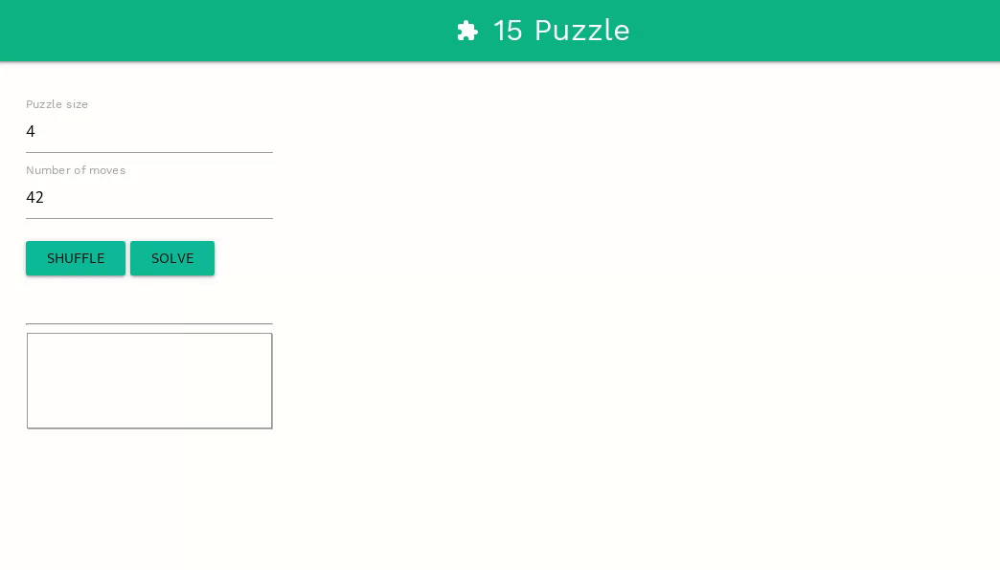

# 15-Puzzle
__Summary:__ The goal of this project is to programmatically solve the [15-puzzle](https://en.wikipedia.org/wiki/15_puzzle) game using the [A\*](https://en.wikipedia.org/wiki/A*_search_algorithm) search algorithm or one of its variants.

__How to run:__

- Install packages `$ npm install`

- Run server: `$ npm start`

- Open in browser: `localhost:8080`

